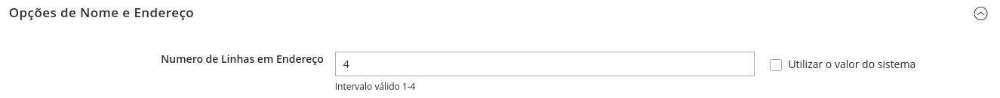
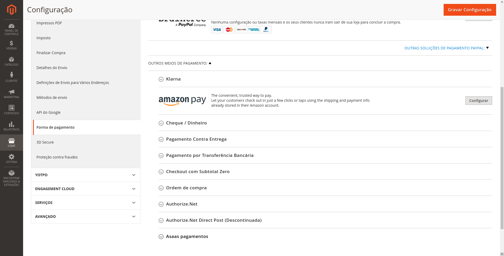
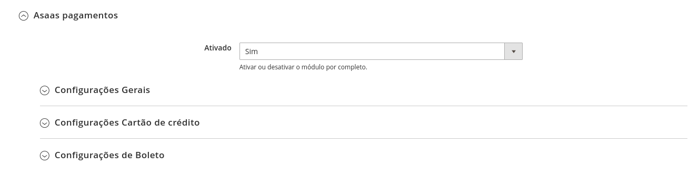
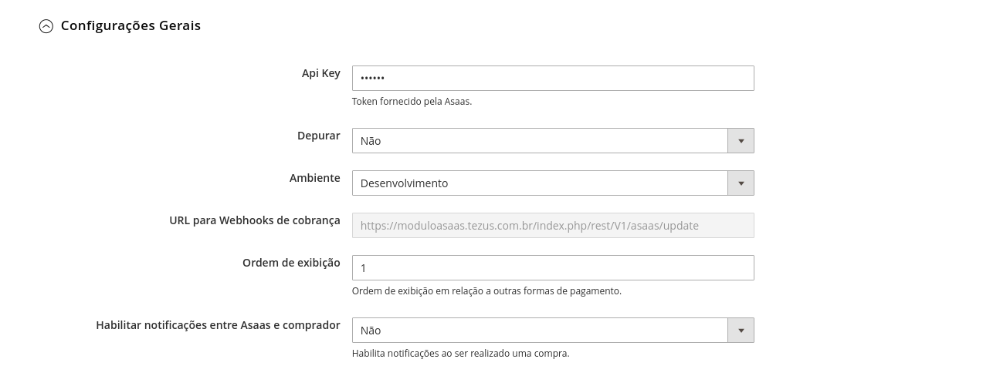
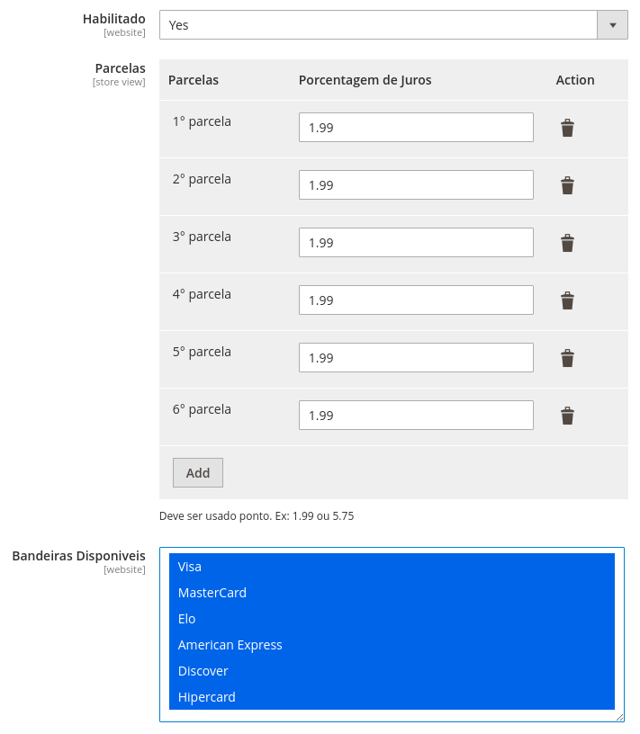
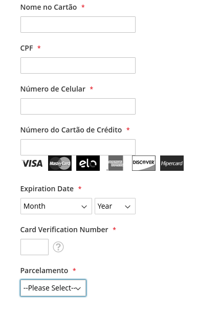
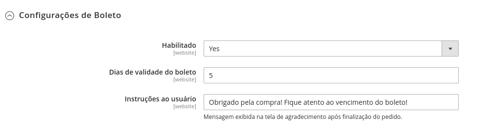

# Módulo de integração [Asaas Pagamentos](https://www.asaas.com/) 

## Instalação

> Recomendamos que você possua um ambiente de testes para validar as alterações e atualizações antes de atualiar sua loja em produção. Também que seja feito um **backup** com todas as informações antes de executar qualquer procedimento de atualização/instalação.

### Versões Compativeis:

- [x] 2.3.x
- [x] 2.4.x
 
### Pré requisito:

- Requer a que o PHP esteja no mínimo na versão 7.1.X.

### Instalação do Módulo Asaas:

- Realize o download do módulo e siga os seguintes passos de acordo com a forma que sua loja foi instalada:

#### [Asaas-Magento2 ](https://github.com/tezusecommerce/asaas-magento-2.git)

### Instalar usando o Composer

1. Instale via packagist 
   - ```composer require asaas/module-magento2```
       - Neste momento, podem ser solicitadas suas credenciais de autenticação do Magento. Caso tenha alguma dúvida, há uma descrição de como proceder nesse [link da documentação oficial](http://devdocs.magento.com/guides/v2.0/install-gde/prereq/connect-auth.html).
2. Execute os comandos:
   - ```php bin/magento setup:upgrade```
   - ```php bin/magento setup:static-content:deploy``` ou ```php bin/magento setup:static-content:deploy pt_BR```, de acordo com as configurações da sua loja.

   ### Instalar usando o github

- Caso sua loja tenha sido criada por meio do clone ou download do projeto magento, siga os seguintes passos:

1. Extraia o conteúdo do download ZIP e mova o para ```\Magento2\``` para dentro da pasta ```Asaas```
2. Verifique se está dessa maneira seus diretórios na sua loja ```app/code/Asaas/Magento2```
3. Execute o comando ```bin/magento setup:upgrade```
4. Execute o comando ```bin/magento setup:di:compile```
5. Execute o comando ```bin/magento setup:static-content:deploy -f```
6. Execute o comando ```bin/magento cache:clean```


### Configurações

Acesse no Painel Administrativo do Magento no menu lateral clique em `Lojas`, depois clique em `Configuração`, na sequencia clique em `Clientes`, depois `Configurações de Cliente`, depois acesse a opção `Opções de Nome e Endereço`. Em `Número de Linhas em Endereço` você deve informar o número 4, conforme imagem abaixo:



Após realizar a configuração do Cliente, acesse no Painel Administrativo do Magento No menu lateral clique em `Lojas`, na sequencia clique em `Configuração`, no sub-menu `Vendas` clique em `Formas de Pagamento`. Será carregada a tela para configurar os meios de pagamentos do site. 

<p align="center">
  
</p>

### Como habilitar o Asaas no seu site

No primeiro bloco de informação, está a configuração para habilitar ou desabilitar o módulo por completo, marque `Sim` para continuar a configuração. 

Em seguida temos as configurações gerais, configurações de cartão de crédito e configurações de boleto

OBS: Para que todas as configurações a seguir funcionem, todo o passo a passo anterior deve ter sido seguido.
	



### Configurações Gerais

- Api Key
	- Chave de integração da conta Asaas. Os tokens de produção e sandbox são distintos.

- Ambiente
	- Seleciona qual versão de ambiente que o site estará apontando. Os ambientes disponíveis são: ```Desenvolvimento``` e ```Produção```.
	

- URL para Webhooks de cobrança
	- URL a ser informada no Webhook de cobrança no site da Asaas, para que no momento de aprovação do pagamento, o status do pedido seja alterado. 
	
- Ordem de exibição
    - Ordem de exibição dos métodos de pagamento habilitados no módulo sendo mostrados na tela de Checkout.
	
- Habilitar notificações entre Asaas e comprador
    - Habilita mensagens via e-mail informando as alterações de status de pagamento. Podendo esta opção ser habilitada ou não.



### Configurações Cartão de Crédito

- Habilitado
	- Habilita ou desabilita o método de pagamento com cartão de cŕedito.

- Parcelas
    -   Este campo além de trazer a quantidade máxima de parceamento permitida, também já adiciona um percentual de juros em cada parcela caso o cliente opte.

- Tipo do Cartão de Crédito
	- Seleciona e exibe no formulário de cartão de crédito as bandeiras disponíveis para pagamento.



<p align="center">
  
</p>


### Configurações de Boleto

- Habilitado
	- Habilita ou desabilita o método de pagamento com boleto.

- Dias de validade do boleto
    -   Pega a data atual, e adiciona a quantidade solicitada de dias para o vencimento do boleto.

- Instruções ao usuário
	- Mensagem exibida na tela de agradecimento após finalização do pedido.


